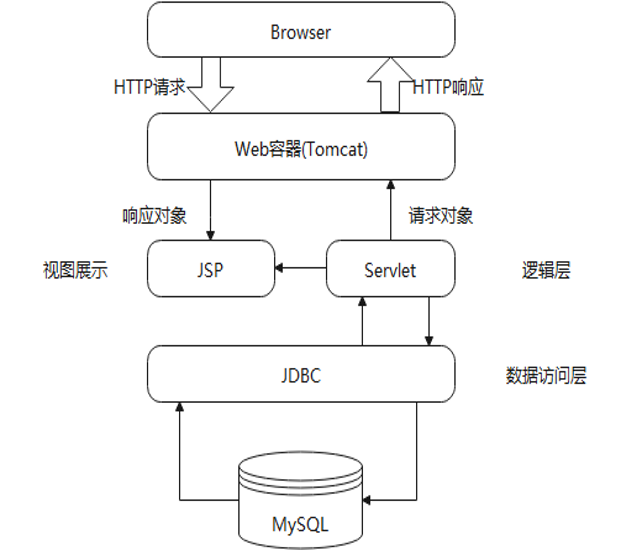
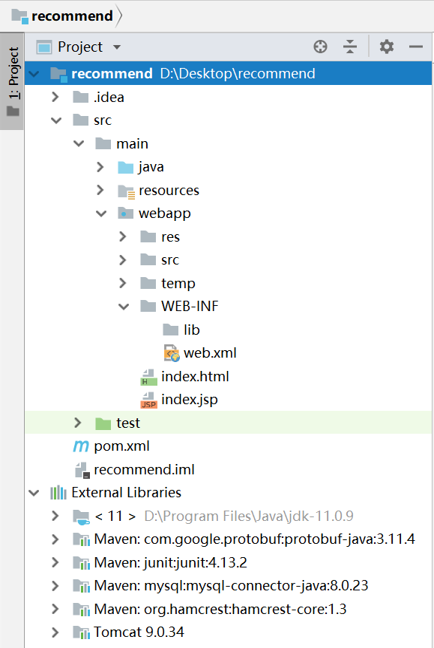
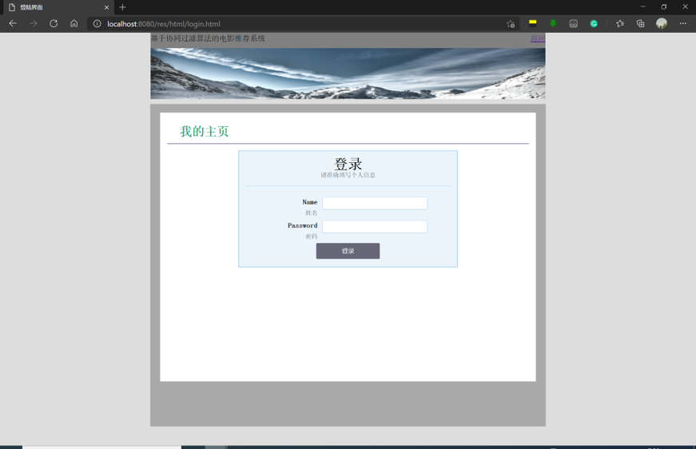
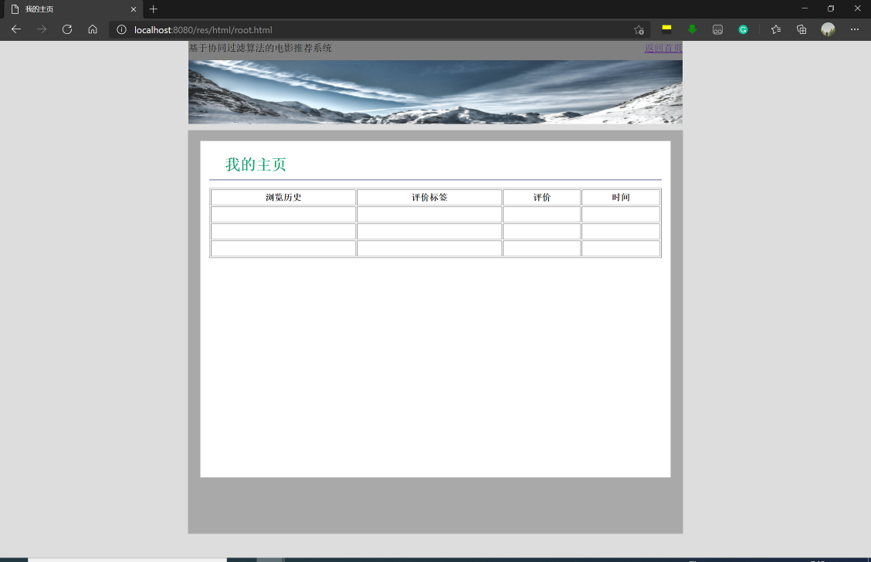
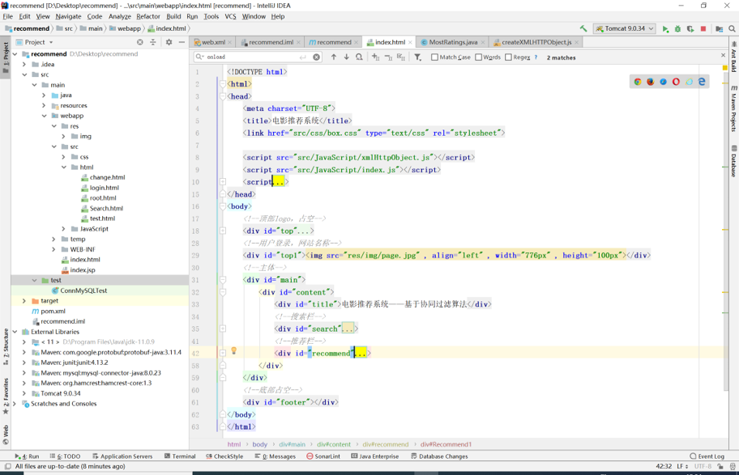

# MovieRecommendationSystem

毕业设计的内容，基于协同过滤算法的电影推荐系统，目前还在学习完善中。

## 1.毕业设计（论文）基本内容和要求

本毕业设计要求了解常用的协同过滤推荐算法，比较不同推荐算法之间的优劣，并在此基础上选择合适的推荐算法，基于真实的数据集进行实验仿真，优化推荐算法达到最优的推荐效果，实现对用户的推荐。并且能够选取合适的指标，对电影推荐的结果进行系统评估。具体地，本毕业设计要求学生：

1. 了解常用的推荐算法，并选取合适的推荐算法进行电影推荐系统的设计
2. 能够熟练的对数据库中的数据进行操作，能够对数据进行一定的处理
3. 能够分析推荐算法的缺陷，改进推荐算法，达到更好的推荐效果
4. 能够选取合适的指标，对推荐结果进行分析，并设计可视化界面，将结果可视化

在这个仓库下体现的是，对推荐结果进行可视化的部分，推荐结果从数据库中读取，并且将结果显示到浏览器页面上。

涉及技术：JDBC数据存储(MySQL数据库)，Ajax通信，Servlet响应处理，HTML、CSS、Javascipt等

## 2.拟采用的研究方案

整个流程分为三个部分：数据收集及处理，模型训练和电影推荐。
在数据集上，数据的来源选择MovieLens的数据，该网站现在有超过45000用户对6600不同的电影发表意见，从数据集的真实性、规模等角度来看，都可以为后续的研究提供保障。
在推荐模型上，我们设计神经协同过滤模型为用户与电影建模，分别用矩阵分解与多层感知机学习用户与电影的特征向量，为了充分挖掘数据中线性与非线性关系，将两种方法学习到的向量结合，实现电影推荐，方案如下：

1. 学习海量数据下的线性关系：基于用户与基于物品的协同过滤在数据较大时推荐性能下降。而矩阵分解被广泛应用于推荐系统，它能够将高维数据分解为低维度的向量，以特征因子内积相乘来预测评分，我们以矩阵分解的方法分解得到用户与电影的隐层因子，充分学习数据中的线性关系。
2. 挖掘数据中的非线性关系：以特征向量内积方式来为用户与电影建模，只能捕捉到行为数据中的线性关系，而多层感知机作为神经网络具有非线性数据的学习能力，使模型挖掘并学习数据中复杂的信息。
3. 向量整合：为了让模型更好地学习数据中蕴含的线性与非线性关系，我们结合由矩阵分解与多层感知机学习到的特征向量来更好地为用户与电影建模。

## 3.本系统相关

### 整体架构

自上至下各部分

- Tomcat Tomcat 服务器是一个免费的开放源代码的Web 应用服务器，属于轻量级应用服务器，在中小型系统和并发访问用户不是很多的场合下被普遍使用，是开发和调试JSP 程序的首选。
- JSP（Java Server Pages）JSP页面由HTML代码和嵌入其中的Java代码所组成。服务器在页面被客户端所请求以后对这些Java代码进行处理，然后将生成的HTML页面返回给客户端的浏览器。JSP可以使用Servlet提供的API，一般和JavaBean结合使用，从而将界面表现和业务逻辑分离。
- Servlet Servlet是一种小型的Java程序，它扩展了Web服务器的功能。作为一种服务器端的应用，当被请求时开始执行。Servlet提供的功能大多与JSP类似，不过实现的方式不同。JSP通常是大多数HTML代码中嵌入少量的Java代码，而servlets全部由Java写成并且生成HTML。
- JDBC 数据库连接(Java Database) JDBC是一组用于执行SQL的Java API ，为访问不同的数据库提供了一种统一的途径，几乎所有的关系型数据库厂商（DBMS）都提供了JDBC的服务或驱动。JDBC对数据库的访问也具有平台无关性
- MySQL MySQL 是最流行的关系型数据库管理系统，在 WEB 应用方面 MySQL 是最好的 RDBMS(Relational Database Management System：关系数据库管理系统)应用软件之一。

### Project的结构

- 整体使用Maven约定的目录结构

1. Java文件夹 ------- Source Root 该文件夹及其子文件夹包含应在构建过程中进行编译的源代码。
2. webapp文件夹------- web roots 配置的网站根目录，也就是默认打开浏览器输入localhost:8080/的目录。
3. web.xml  ------- deployment Descriptor web.xml文件是用来初始化配置信息：比如Welcome页面、servlet、servlet-mapping、filter、listener、启动加载级别等。
4. pom.xml  ------- deploymentDescriptor Maven项目管理中使用的文件，用于记录文件信息和添加项目的相关依赖。目前添加的依赖内容：jUnit(测试类使用)、mysql(MySQL驱动文件)，Tomcat(Web容器)	
5. 其他 test编写类的测试文件，编译结果将输出到recommend/target文件夹

### 用户界面

首页是用户打开系统时的交互界面。

搜索框---用户可以通过搜索框搜索自己想要的电影，用户通过表单发送GET请求向服务器端。

推荐框一---根据电影数据信息，向用户推荐数据库中评分最高、观看人数最多的电影。这里放它的作用是练习与MySQL数据库的连接接收数据。

推荐框二---根据用户的个人信息，对其进行个性化推荐，功能待完善。

推荐评价---推荐系统通过切分训练集与测试集，训练模型，推荐，评估得出的衡量模型质量指标。

用户通过登录以获得自身独特的推荐结果。用户登录的姓名需要是数据库中已有的，否则会提示用户不存在信息。

这里将会显示用户对所有已评价的电影内容信息，包括对电影的标签和评分

用户浏览界面html